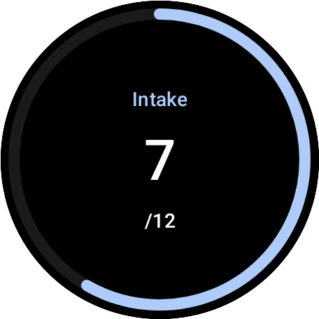

# Rappel d'Hydratation

Rappel d'Hydratation, conçue pour les montres connectée sous `wear-os` en utilisant la technologie `jetpack compose`, vous aide chaque jour à rester `hydraté`.

Vous recevrez des `notifications` de `08:00 à 22:59` directement sur votre montre sans avoir besoin de quelconque connexion à votre smartphone, ni d'avoir à reglé des alarmes manuellement.

**[English][en]** - [Français][fr]

## Fonctionalités

- [x] notification intégrée depuis la montre
- [x] configuration de la fréquence de notification (1h, 3h, désactivé)
- [x] de jolies cartes pour une interaction simple sans ouvrir l'application
- [x] possibilité d'importer et d'export vos données
- [x] quelques astuces d'hydratation

## Pour commencer
> [!NOTE]
> `Télécharger` l'application sur la page `release` de github.

### Procedure d'installation
Il existe multiples methodes d'installer une application sur les montres sous wear os. Voici la methode que j'utilise:

> [!IMPORTANT]
> Le `Débogage sans fil` doit être activé pour cette procédure. Vous pouvez facilement l'activé dans les paramètres de developpeurs dans les paramètres.

```bash
# appareillez et connectez votre montre à votre ordinateur
adb pair [ADDRESSE_IP_MONTRE]:[PORT_APPAREILLAGE] [CODE_APPAREILLAGE]
adb connect [ADDRESSE_IP_MONTRE]:[PORT_DE_CONNEXION]
# pour confirmer que ça a marché
adb devices
# vous devriez voir votre montre listée
# maintenant, reste plus qu'à installer l'application
adb install -r chemin/vers/l'applicationapp.apk
```

et `voilà`!

## Captures d'écran

|                        Home                        |                        Notification                         |                        Historique                         |                     Historique graphes                     |                        Carte 1                         |                        Carte 2                         |
| :------------------------------------------------: | :---------------------------------------------------------: | :----------------------------------------------------: | :---------------------------------------------------: | :---------------------------------------------------: | :---------------------------------------------------: |
|  |  |  |  |  |  |

Vous trouverez plus d'images dans le dossier [`./img`](./img/).
