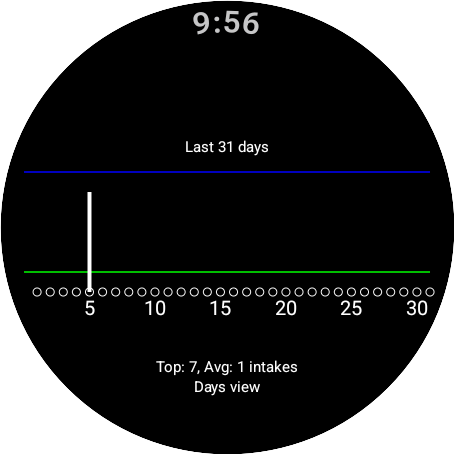
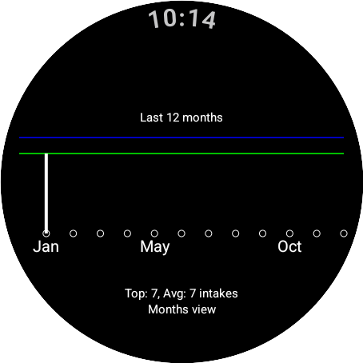
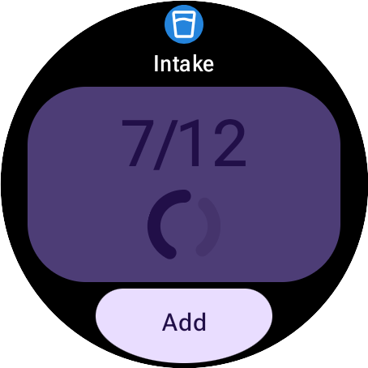
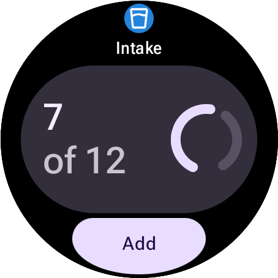

# WaterReminder

WaterReminder, built for `wear-os` devices using `jetpack compose`, to help you
stay `hydrated` throughout the days.

Receive `notifications` from `8am to 10:59 pm` on your watch without the need
to have a phone connected to it, nor have to set up alarms manually.

**[English][en]** - [Français][fr]

## Features

- [x] Material 3 Expressive
- [x] Built-in notifications
- [x] Configurable notification frequency (1h, 3h, deactivated)
- [x] Beautiful tiles
- [x] Import/export feature (communicate with http server locally)
- [x] Built-in hydration tips

## Getting Started

> [!NOTE]
> `Download` the app in the github `release` page.

> [!WARNING]
> If you have version `v1` installed, consider making a `backup` of your data.
> It's not that difficult. You might get a problem with `app signatures` otherwise.
> You'll see in the `release` page, some steps into making the backup process.

> Old import/export will be removed in favor of using the tool here
> [Tui \& Cli](https://github.com/RomaricKc1/water_reminder-backup_restore.git). Just launch this binary (downloadable in the release page as well)
> with the appropriate address and port, and do the process in the app.
> You may change the `endpoint` from the watch app if desired.

### Installation process

There are various ways into installing an app on your wear os based watch.
Here's what I usually do:

> [!IMPORTANT]
> `Wireless debugging` should be enabled in order to this to work. You can enable
> it in the `developer` options on your watch.

```bash
# pair and connect to your watch from your pc
adb pair [watch_IP_addr]:[PAIR_PORT] [PAIRING CODE]
adb connect [watch_IP_addr]:[CONNECTION_PORT]
# you can confirm that it's paired using
adb devices
# you should see your watch listed in there
# now, install the app
adb install -r path/to/the/app.apk
```

And `voilà`!

## Screenshots

|                        Home                        |                        Notification                         |                          History days                           |                          History months                          |                            Tile detailed                            |                         Tile zen                         |                          Tile goal                           |
| :------------------------------------------------: | :---------------------------------------------------------: | :-------------------------------------------------------------: | :--------------------------------------------------------------: | :-----------------------------------------------------------------: | :------------------------------------------------------: | :----------------------------------------------------------: |
|  |  |  |  |  |  |  |

More in the [`./img`](./img/) folder.

[en]: README.md
[fr]: README.fr.md
