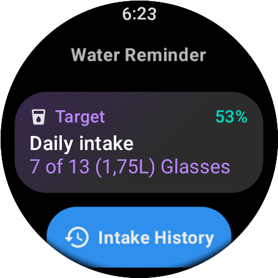

# WaterReminder

WaterReminder, built for `wear-os` devices using `jetpack compose`, to help you stay `hydrated` throughout the days.

Receive `notifications` from `8am to 10:59 pm` on your watch without the need to have a phone connected to it, nor have to set up alarms manually.

**[English][en]** - [Français][fr]

## Features

- [x] built-in notifications
- [x] configurable notification frequency (1h, 3h, deactivated)
- [x] beautiful tiles
- [x] import/export feature
- [x] built-in hydration tips

## Getting Started

> [!WARNING]
> If you have version `v1` installed, consider making a `backup` of your data. It's not that difficult. You might get a problem with `app signatures` otherwise. You'll see in the `release` page, some steps into making the backup process.

> [!NOTE]
> `Download` the app in the github `release` page.

### Installation process

There are various ways into installing an app on your wear os based watch. Here's what I usually do:

> [!IMPORTANT]
> `Wireless debugging` should be enabled in order to this to work. You can enable it in the `developer` options on your watch.

```bash
# pair and connect to your watch from your pc
adb pair [watch_IP_addr]:[PAIR_PORT] [PAIRING CODE]
adb connect [watch_IP_addr]:[CONNECTION_PORT]
# you can confirm that it's paired using
adb devices
# you should see your watch listed in there
# now, install the app
adb install -r path/to/the/app.apk
```

And `voilà`!

## Screenshots

|                        Home                        |                        Notification                         |                        History                         |                     History Graph                     |                        Tile 1                         |                        Tile 2                         |
| :------------------------------------------------: | :---------------------------------------------------------: | :----------------------------------------------------: | :---------------------------------------------------: | :---------------------------------------------------: | :---------------------------------------------------: |
|  |  |  |  |  |  |

More in the [`./img`](./img/) folder.
